# NoSQL Databases: Redis

## Build master-slave redis cluster.

```docker
version: '3.8'

services:
  redis-master:
    image: redis:latest
    container_name: redis-master
    ports:
      - "6379:6379"
    volumes:
      - ./conf/redis-master.conf:/usr/local/etc/redis/redis.conf
      - redis-master-data:/data
    command: redis-server /usr/local/etc/redis/redis.conf

  redis-slave-1:
    image: redis:latest
    container_name: redis-slave-1
    ports:
      - "6380:6379"
    volumes:
      - ./conf/redis-slave.conf:/usr/local/etc/redis/redis.conf
      - redis-slave-1-data:/data
    command: redis-server /usr/local/etc/redis/redis.conf
    depends_on:
      - redis-master

  redis-slave-2:
    image: redis:latest
    container_name: redis-slave-2
    ports:
      - "6381:6379"
    volumes:
      - ./conf/redis-slave.conf:/usr/local/etc/redis/redis.conf
      - redis-slave-2-data:/data
    command: redis-server /usr/local/etc/redis/redis.conf
    depends_on:
      - redis-master

volumes:
  redis-master-data:
  redis-slave-1-data:
  redis-slave-2-data:
```

### Enter redis container

```bash
docker exec -it redis-master redis-cli -a yourmasterpassword
```

## Try all eviction strategies.

### noeviction

To test the `noeviction` strategy, I generated a large number of keys and values in the Redis database.
I used a Python script ([CacheFillerNoEviction.py](CacheFillerNoEviction.py)) to generate the keys and values.
After inserting `67355` key when maxmemory is `1MB`, the Redis server stopped accepting new keys and values and I received the following error message:

```shell
  File "/Users/linnyk/IdeaProjects/LeetCoder/venv/lib/python3.11/site-packages/redis/client.py", line 565, in parse_response
    response = connection.read_response()
               ^^^^^^^^^^^^^^^^^^^^^^^^^^
  File "/Users/linnyk/IdeaProjects/LeetCoder/venv/lib/python3.11/site-packages/redis/connection.py", line 536, in read_response
    raise response
redis.exceptions.OutOfMemoryError: command not allowed when used memory > 'maxmemory'.
```

---

### allkeys-lru

To test the `allkeys-lru` strategy, I generated a large number of keys and values in the Redis database.
I used a Python script ([CacheFillerAllkeysLRUEviction.py](CacheFillerAllkeysLRUEviction.py)) to generate the keys and values.
And `maxmemory 3mb`

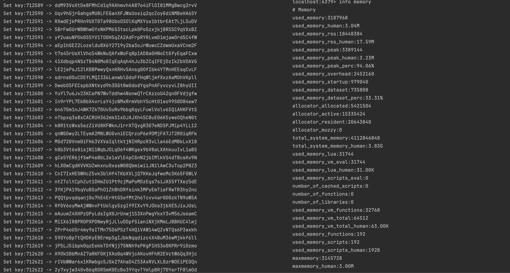

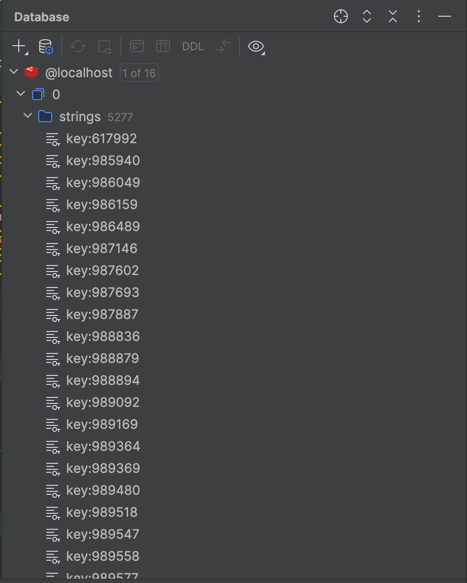

```bash
localhost:6379> EXISTS key:712605
(integer) 0
```

and list resent key still in the cache.

```bash
localhost:6379> EXISTS key:999999
(integer) 1
```

---

### allkeys-lfu

To test the `allkeys-lfu` strategy,
I generated a number of keys and values in the Redis database and then did access to a random key.
I used a Python script ([CacheFillerAllkeysLFUEviction.py](CacheFillerAllkeysLFUEviction.py)) to generate the keys and values.
And `maxmemory 4mb`

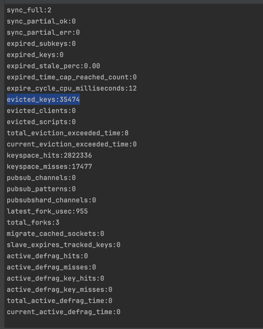

---

### volatile-lru

To test the `volatile-lru` strategy,
I generated a number of `5000` key-value pair with `80` seconds ttl
and then again generated `5000` key-value pair but without ttl
I used a Python script ([CacheFillerVolatileLRUEviction.py](CacheFillerVolatileLRUEviction.py)) to generate the keys and values.
And `maxmemory 4mb`

#### This is a data in database right after insert `10000` records

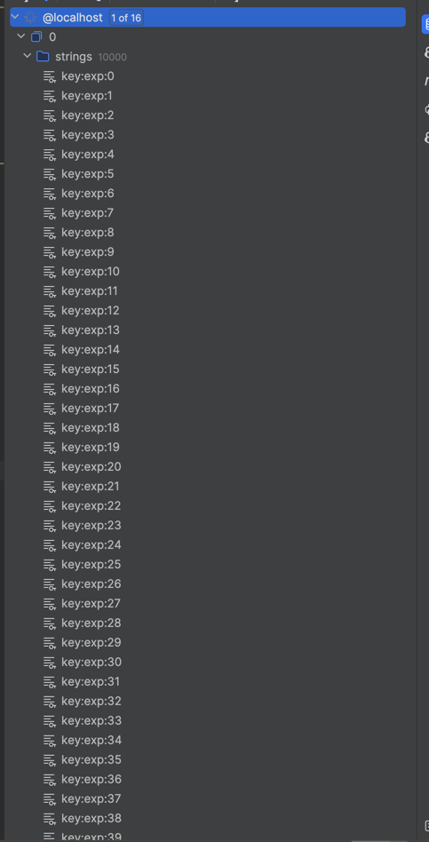

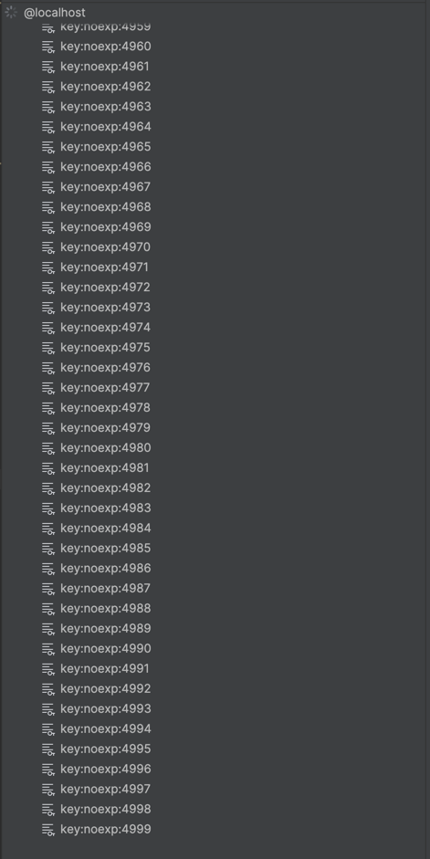

### And this is after `80` seconds

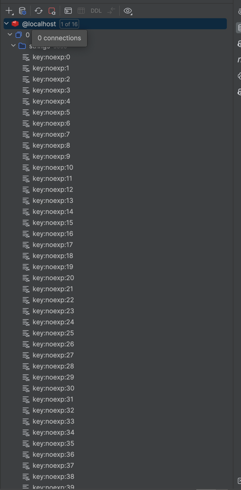

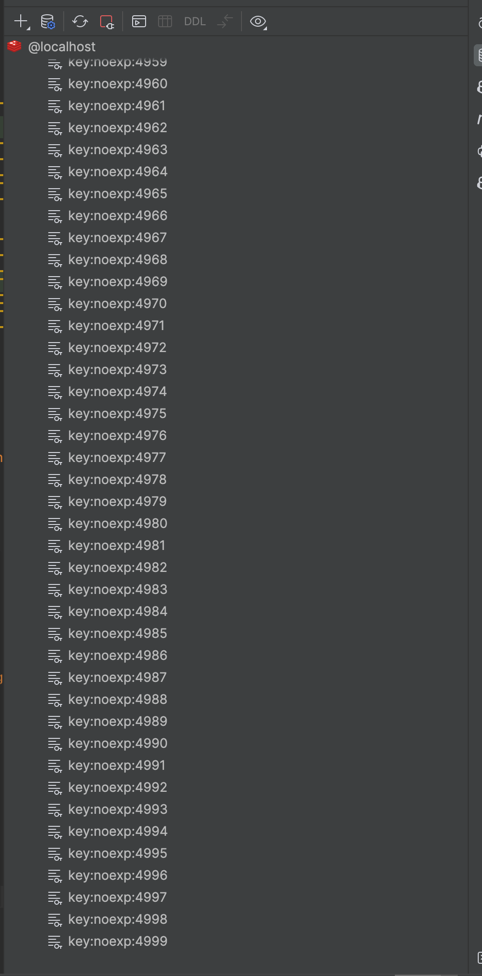

---

### volatile-lfu

To test the `volatile-lfu` strategy,
I generated a number of `5000` key-value pair with `80` seconds ttl
and then again generated `5000` key-value pair but without ttl and then did random access to random key
I used a Python script ([CacheFillerVolatileLFUEviction.py](CacheFillerVolatileLFUEviction.py)) to generate the keys and values.
And `maxmemory 4mb`

---

### allkeys-random

To test the `allkeys-random` strategy,
I generated 100000 records with [CacheFillerAllKeysRandom.py](CacheFillerAllKeysRandom.py)
and after insertion the number of records started to delete when insertion happens.
And also it clear by id that some random records were removed.

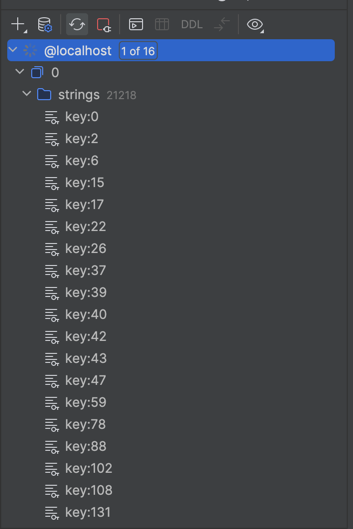

---

### volatile-random

To test the `volatile-random` strategy, I inserted `12000` records with ttl `80` seconds and `24000` with no expiration

### After insertion 

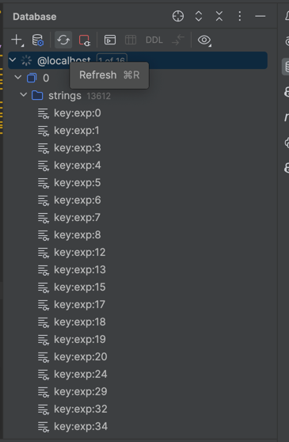

### After 80 seconds started to delete random records with no expiration

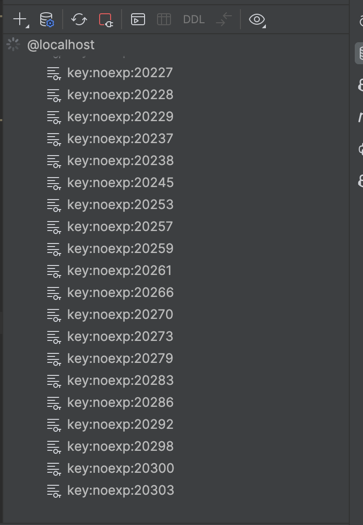

---

### The volatile-ttl

> The volatile-ttl policy evicts keys with expiration times based on their time-to-live (TTL) values, specifically evicting the keys with the shortest TTL first when the maxmemory limit is reached.### volatile-ttl

To test the `volatile-ttl` strategy,
I generated 5000 records with [CacheFillerVolatileTTL.py](CacheFillerVolatileTTL.py)
and after insertion the number of records started to delete when insertion happens.

### Keys with smaller ttl were deleted first

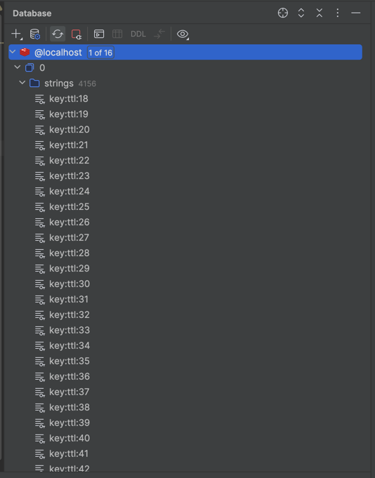

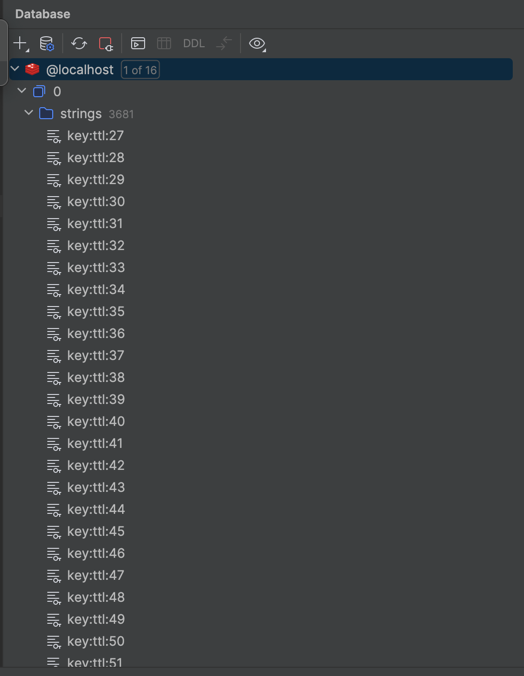

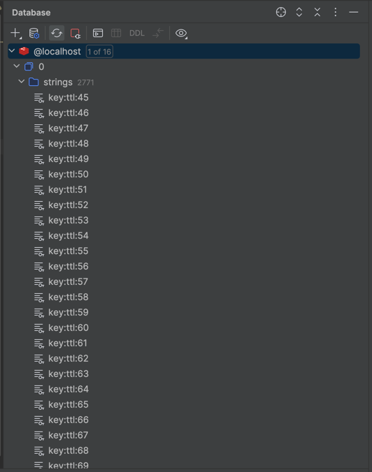

### Keys with higher ttl were in cache

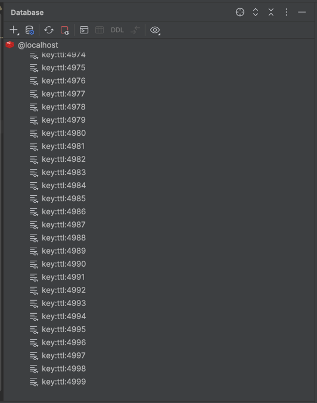

---

## Write a wrapper for Redis Client that implement probabilistic cache.

### Probabilistic early expiration cache implementation in Java [ProbabilisticEarlyExpirationCache.java](src/main/java/demo/redisdemo/ProbabilisticEarlyExpirationCache.java)

```java
public String fetch(String key, int ttl, CacheLoader loader) {
    var entry = cacheRead(key);
    var currentTime = System.currentTimeMillis();

    if (entry == null || shouldRecompute(entry, currentTime)) {
        var startTime = System.currentTimeMillis();
        var value = loader.load();
        var delta = System.currentTimeMillis() - startTime;

        cacheWrite(key, value, delta, ttl);
        return value;
    }

    return entry.getValue();
}

private boolean shouldRecompute(CacheEntry entry, long currentTime) {
    var randomValue = random.nextDouble();
    var threshold = entry.getDelta() * beta * Math.log(randomValue);
    return (currentTime - threshold) >= entry.getExpiry();
}
```

### Using probabilistic early expiration cache [Main.java](src/main/java/demo/redisdemo/Main.java)

```java
public static void main(String[] args) throws InterruptedException {
    var cache = new ProbabilisticEarlyExpirationCache("localhost", 6379, 1.0);

    cache.put("key1", "value1", 10);

    var value = cache.fetch("key1", 10, () -> {
        return "value2";
    });
    System.out.println("Value for key1: " + value); // Should print "value1"


    Thread.sleep(10000);
    value = cache.fetch("key1", 10, () -> {
        return "value2";
    });
    System.out.println("Value for key1: " + value); // Should print "value2"

    cache.close();
}
```

### Results

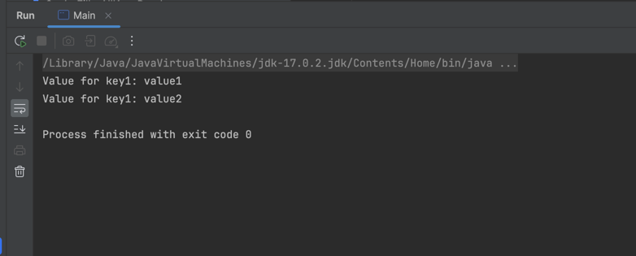